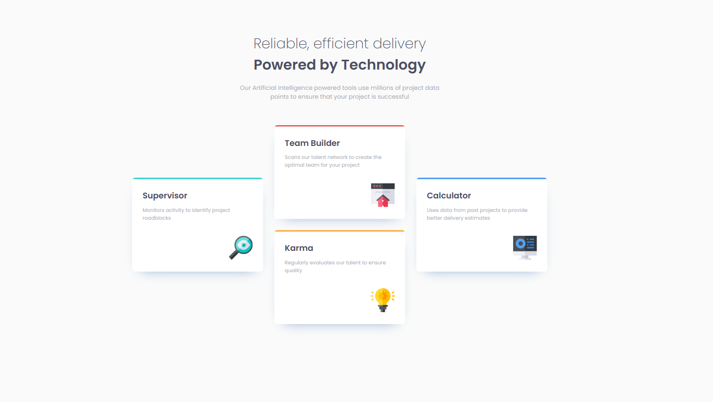

# Frontend Mentor - Four card feature section solution

This is a solution to the [Four card feature section challenge on Frontend Mentor](https://www.frontendmentor.io/challenges/four-card-feature-section-weK1eFYK). Frontend Mentor challenges help you improve your coding skills by building realistic projects.

## Table of contents

- [Overview](#overview)
  - [The challenge](#the-challenge)
  - [Screenshot](#screenshot)
  - [Links](#links)
- [My process](#my-process)
  - [Built with](#built-with)
  - [What I learned](#what-i-learned)
  - [Useful resources](#useful-resources)
- [Author](#author)
- [Acknowledgments](#acknowledgments)

## Overview

### The challenge

Users should be able to:

- View the optimal layout for the site depending on their device's screen size

### Screenshot

### Links

- Solution URL: [GitHub](h)
- Live Site URL: [GitHub Pages]()

## My process

As usual - I developed a proper semantic HTML markup with BEM classes for CSS hooks. Afterwards, as always, started with mobile layouts first and then the desktop layouts using top-down approach with major layouts first and then fixing the details like spacing and font-sizing.

### Built with

- Semantic HTML5 markup
- CSS custom properties
- CSS Grid

### What I learned

I learned that Flexbox's `flex: 1` trick for getting equal 'columns' measures only the content box even if `box-sizing` is set to `border-box`. That's why the central column that contains 2 middle cards for desktop layout was slightly narrower than the lateral card columns that weren't wrapped. The fix for this is either wrapping side cards in 'column' wrappers as well or (as in my case) just use Grid layout with `grid-template-columns` and column width set to`1fr` for how many columns you want - columns will always be equal sized.

### Useful resources

- [Kevin Powell](https://www.youtube.com/watch?v=fm3dSg4cxRI) - has a video that explains the aforementioned effect for `flex` and how to _fix_ it.

## Author

- Frontend Mentor - [@marisudris](https://www.frontendmentor.io/profile/marisudris)
- GitHub - [@marisudris](https://www.github.com/marisudris)

## Acknowledgments

[Kevin Powell](https://www.youtube.com/kevinpowell) has quite a lot of awesome videos exploring some of the Flex and Grid quirks.

Rachel Andrew has a [great post](https://www.smashingmagazine.com/2018/09/flexbox-sizing-flexible-box/) on Flex sizing that can further clear up some confusion (in particular - how the text content sizing works).
